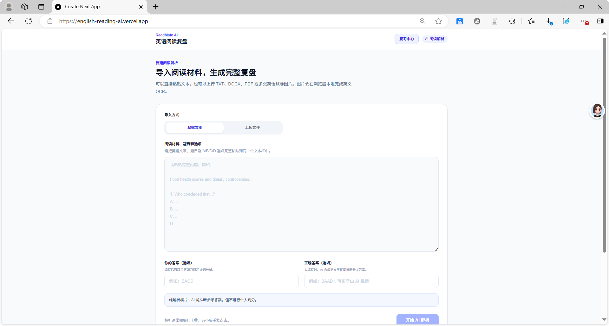
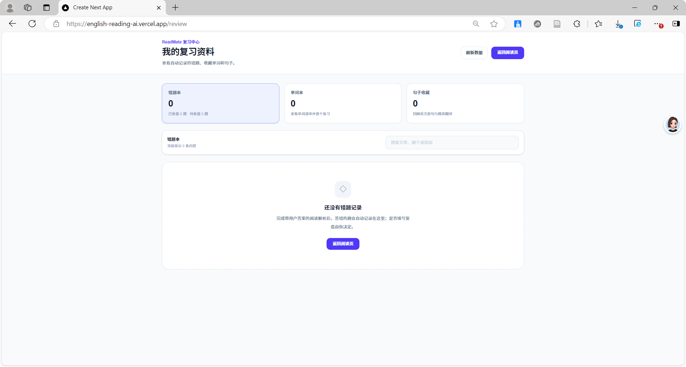

suestion: What is the main purpose of the passage?

Evidence: （原文关键句自动定位）

Analysis:
Option A：xxx（正确/错误原因）
Option B：xxx（正确/错误原因）
...
```

### 2\. 全文双语对照 \+ 长难句精讲

针对看不懂的文章和复杂句式，提供一站式理解方案：

- 英文原文 \+ 精准中文翻译，全文对照阅读

- 告别模糊读懂，做到句句吃透、精准理解

### 3\. 个人专属学习复盘系统

所有学习数据自动留存，不用手动整理，越练越有积累：

**📚 生词本**

- 一键收藏陌生单词

- 查看详细释义和原文原生例句

- 标记单词掌握状态，针对性复习薄弱词汇

**📝 长难句收藏夹**

- 保存经典复杂句式，支持双语对照查看

- 随时回看复盘，攻克语法薄弱点

**❌ 错题本复盘**

- 自动留存所有错题，无需手动摘抄

- 回看详细错误分析和解题思路

- 快速跳转原文，重新理解整篇文章逻辑

---

## ⚙️ 工作流程

整个处理流程全自动、无需人工干预：

用户上传文件 → 文档文本提取 → 内容结构化整理 → Dify 智能工作流处理 → 大模型推理分析 → 内容质量校验 → 生成完整阅读解析报告 → 自动归档至个人学习库

---

## 🛠 技术栈

**前端**：Next\.js 16、TypeScript、React、Tailwind CSS

**AI 核心**：Dify 工作流、大语言模型推理

**文档处理**：pdf\.js、mammoth、OCR 文本识别

**部署方式**：Vercel 云端部署

---

## 🗂 项目结构

```Plain Text
src
├── app            # 核心业务与接口
│   ├── analyze        # 阅读题目解析接口
│   ├── extract-text   # 文本提取接口
│   └── lookup-word    # 单词查询接口
├── components     # 全局可复用组件
├── lib            # 工具函数
│   ├── pdfToImages.ts    # PDF 处理
│   ├── localOcr.ts       # 本地OCR识别
│   └── reviewStorage.ts  # 学习数据本地存储
├── data           # 静态资源与常量
└── types          # 全局TS类型定义
```

---

## 🚀 在线体验

直接打开链接即可使用，无需本地部署：

[https://english\-reading\-ai\.vercel\.app](https://english-reading-ai.vercel.app)

---


## 📸 项目截图

### AI 阅读解析主页




### 错题复盘页面




### 单词复习页面


---

```
## 🚀 Demo

Online Demo:

https://english-reading-ai.vercel.app
```

## 🔮 未来规划

项目会持续迭代，后续将上线更多实用功能：

- 用户账号系统，实现数据独立管理

- 云端数据同步，多设备无缝切换

- 多大模型切换选择，适配不同解析需求

- AI 个性化学习路径推荐，针对性弥补短板

> （注：部分内容可能由 AI